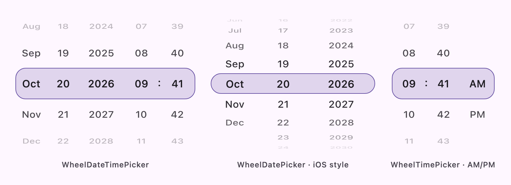

# Datetime Wheel Picker

[](https://central.sonatype.com/artifact/io.github.darkokoa/datetime-wheel-picker)
[](https://github.com/darkokoa/datetime-wheel-picker/actions/workflows/build.yml)
[](LICENSE)

![badge-android][badge-android]
![badge-jvm][badge-jvm]
![badge-ios][badge-ios]
![badge-js][badge-js]
![badge-wasm][badge-wasm]

**English** | [简体中文](README.zh-CN.md)

Highly customizable wheel pickers for **date**, **time** and **date-time** selection, built with
[Compose Multiplatform](https://www.jetbrains.com/compose-multiplatform/). Rows sit on a
cylindrical barrel like a native iOS picker, and 30 languages work out of the box.

> [!NOTE]
> This README documents `main`, which is **1.5.0 (unreleased)**. The `rows` and `barrelProperties`
> parameters need 1.5.0; the latest release is 1.4.0 (use `rowCount` there). See
> [MIGRATION.md](MIGRATION.md) and [CHANGELOG.md](CHANGELOG.md).

<picture>
  <source media="(prefers-color-scheme: dark)" srcset="docs/images/hero-dark.png">
  
</picture>

| Picker | Basic usage |
|--------|-------------|
| Date and time | `WheelDateTimePicker { snappedDateTime -> }` |
| Date | `WheelDatePicker { snappedDate -> }` |
| Time (24-hour) | `WheelTimePicker { snappedTime -> }` |
| Time (AM/PM) | `WheelTimePicker(timeFormatter = timeFormatter(timeFormat = TimeFormat.AM_PM)) { snappedTime -> }` |

<!-- TODO: add a link to the live Wasm demo once it is published. -->

## Features

- **Date, time and date-time wheels**, plus a generic `WheelTextPicker` for your own values.
- **Barrel projection**: rows curve around a drum with a configurable rim angle and edge fade,
  from a flat list to the full iOS half cylinder.
- **Fixed row count or fixed row height**: `WheelRows.Count(n)` or `WheelRows.Height(h)`.
- **Modifier-driven sizing**: `fillMaxWidth()`, `size()`, `weight()` and friends just work.
- **Flexible date fields**: day-month-year, month-day-year or year-month-day order; hide the year
  to get day-month or month-day pickers; limit the selectable range.
- **Localization**: 30 languages, locale-aware date order and 12/24-hour time, CJK 年/月/日
  suffixes, and localized numerals.
- **Fully styleable**: text styles and colors (with separate ones for the selected item), selector
  shape, color and border, Material 3 integration.
- **Callbacks that behave**: live updates while scrolling and a single final value when the wheel
  settles.
- **Kotlin Multiplatform**: Android, iOS, Desktop (JVM), JS and Wasm.

## Installation

Add the dependencies to your version catalog (`gradle/libs.versions.toml`):

```toml
[versions]
datetime-wheel-picker = "1.4.0" # 1.5.0 once released; see the note above
kotlinx-datetime = "0.8.0"

[libraries]
datetime-wheel-picker = { module = "io.github.darkokoa:datetime-wheel-picker", version.ref = "datetime-wheel-picker" }
kotlinx-datetime = { module = "org.jetbrains.kotlinx:kotlinx-datetime", version.ref = "kotlinx-datetime" }
```

In a Compose Multiplatform project, add them to `commonMain`:

```kotlin
kotlin {
  sourceSets {
    commonMain.dependencies {
      implementation(libs.datetime.wheel.picker)
      implementation(libs.kotlinx.datetime) // the pickers expose its LocalDate, LocalTime, ...
    }
  }
}
```

In a single-platform project (for example Android), use the `dependencies` block instead:

```kotlin
dependencies {
  implementation(libs.datetime.wheel.picker)
  implementation(libs.kotlinx.datetime)
}
```

Artifacts are published to Maven Central, so make sure `mavenCentral()` is in your repositories.

<details>
<summary><b>Without a version catalog</b></summary>

```kotlin
implementation("io.github.darkokoa:datetime-wheel-picker:<version>")
implementation("org.jetbrains.kotlinx:kotlinx-datetime:0.8.0")
```

</details>

<details>
<summary><b>Android minSdk below 26</b></summary>

Enable [core library desugaring](https://developer.android.com/studio/write/java8-support#library-desugaring):

```kotlin
android {
  compileOptions {
    isCoreLibraryDesugaringEnabled = true
  }
}

dependencies {
  coreLibraryDesugaring("com.android.tools:desugar_jdk_libs:2.1.5")
}
```

</details>

### Compatibility

| Library | Kotlin | Compose Multiplatform | kotlinx-datetime | Android minSdk |
|---------|--------|-----------------------|------------------|----------------|
| 1.5.0 (`main`) | 2.4.20 | 1.12.1 | 0.8.0 | 21 |
| 1.4.0 | 2.4.0 | 1.11.1 | 0.8.0 | 21 |

These are the versions each release is built with. Targets: `android`, `jvm`, `iosArm64`,
`iosSimulatorArm64`, `js` and `wasmJs`.

## Quick start

```kotlin
import dev.darkokoa.datetimewheelpicker.WheelDatePicker
import dev.darkokoa.datetimewheelpicker.WheelDateTimePicker
import dev.darkokoa.datetimewheelpicker.WheelTimePicker

@Composable
fun Pickers() {
  // Final value, delivered once the wheel settles
  WheelDatePicker { snappedDate -> /* LocalDate */ }

  WheelTimePicker { snappedTime -> /* LocalTime */ }

  WheelDateTimePicker { snappedDateTime -> /* LocalDateTime */ }

  // Live value while scrolling, plus the final one
  WheelDatePicker(
    onSnappedDateChanged = { date -> /* preview */ },
    onSnappedDate = { date -> /* commit */ },
  )
}
```

Limit the range, start somewhere specific and size the picker with a `Modifier`:

```kotlin
WheelDatePicker(
  modifier = Modifier.fillMaxWidth().height(200.dp),
  startDate = LocalDate(2026, 10, 20),
  minDate = LocalDate(2026, 1, 1),
  maxDate = LocalDate(2026, 12, 31),
) { snappedDate -> }
```

## Barrel and rows

Rows are projected onto a vertical cylinder. `rows` chooses whether the row count or the row
height stays constant, and `barrelProperties` sets how strongly the drum bends and fades:

<picture>
  <source media="(prefers-color-scheme: dark)" srcset="docs/images/rim-angle-dark.png">
  
</picture>

```kotlin
// Three rows with a gentle curve (the default)
WheelDatePicker { }

// Five rows from rim to rim
WheelDatePicker(rows = WheelRows.Count(5)) { }

// iOS style: 32.dp rows, as many as fit, on a full half cylinder
WheelDateTimePicker(
  modifier = Modifier.size(280.dp, 240.dp),
  rows = WheelRows.Height(32.dp),
  barrelProperties = WheelPickerDefaults.barrelProperties(rimAngle = 90f),
) { }

// Flat list, every row opaque
WheelDatePicker(
  barrelProperties = WheelPickerDefaults.barrelProperties(rimAngle = 0f, fadeStrength = 0f),
) { }
```

Details, defaults and the maths are in [Rows and barrel projection](docs/rows-and-barrel.md).

## Customization

```kotlin
WheelDateTimePicker(
  dateFormatter = dateFormatter(
    locale = Locale.current,
    monthDisplayStyle = MonthDisplayStyle.SHORT,
    cjkSuffixConfig = CjkSuffixConfig.HideAll,
  ),
  timeFormatter = timeFormatter(timeFormat = TimeFormat.HOUR_24),
  textStyle = MaterialTheme.typography.titleSmall,
  textColor = Color(0xFFffc300),
  selectedTextStyle = MaterialTheme.typography.titleSmall.copy(fontWeight = FontWeight.Bold),
  selectedTextColor = Color.Black,
  selectorProperties = WheelPickerDefaults.selectorProperties(
    shape = RoundedCornerShape(0.dp),
    color = Color(0xFFf1faee).copy(alpha = 0.2f),
    border = BorderStroke(2.dp, Color(0xFFf1faee)),
  ),
) { snappedDateTime -> }
```

More configurations, such as a day-month picker without a year, a birth-date range, or
Chinese/Japanese/Korean suffixes, are in [Recipes](docs/recipes.md).

## Localization

The pickers follow `Locale.current`: month names, AM/PM text, date order (for example MDY for
`en-US`, YMD for CJK), 12/24-hour time and numerals. Supported languages include Arabic, Chinese,
English, French, German, Hindi, Japanese, Korean, Portuguese, Russian, Spanish and more, 30 in
total. See [Localization](docs/localization.md) for the full list and how locales are matched.

Spotted a translation error or want another language? Please
[open an issue](https://github.com/darkokoa/datetime-wheel-picker/issues) or send a pull request.

## Documentation

| | |
|---|---|
| [API reference](docs/api.md) | Parameters, defaults, callbacks and formatters |
| [Rows and barrel projection](docs/rows-and-barrel.md) | `WheelRows`, rim angle and fade |
| [Sizing](docs/sizing.md) | How `Modifier` constraints resolve to a picker size |
| [Recipes](docs/recipes.md) | Ready-to-use configurations |
| [Localization](docs/localization.md) | Languages, locale matching, numerals |
| [Migration guide](MIGRATION.md) | Upgrading between releases |
| [Changelog](CHANGELOG.md) | What changed in each release |

The `docs/` pages are written in English.

## Sample app

The `sample/` module is a Compose Multiplatform app with demos for every picker, including the
barrel variants. Open the project in Android Studio or IntelliJ IDEA and run `sample:androidApp`,
the iOS app in `sample/iosApp`, or the Desktop entry point (`main.kt` in
`sample/composeApp/src/jvmMain`). To try it in a browser:

```shell
./gradlew :sample:composeApp:wasmJsBrowserDevelopmentRun
```

## Contributing

Issues and pull requests are welcome. Please run `./gradlew check` before sending a pull request.

## License

Released under the [Apache License, Version 2.0](LICENSE).

## Thanks

Inspired by [WheelPickerCompose](https://github.com/commandiron/WheelPickerCompose).
The barrel projection builds on a contribution by [@bnrdk](https://github.com/bnrdk)
([#150](https://github.com/darkokoa/datetime-wheel-picker/pull/150)).

[badge-android]: https://img.shields.io/badge/platform-android-6EDB8D.svg?style=flat
[badge-jvm]: https://img.shields.io/badge/platform-jvm-DB413D.svg?style=flat
[badge-ios]: https://img.shields.io/badge/platform-ios-CDCDCD.svg?style=flat
[badge-js]: https://img.shields.io/badge/platform-js-F8DB5D.svg?style=flat
[badge-wasm]: https://img.shields.io/badge/platform-wasmJs-654FF0.svg?style=flat
