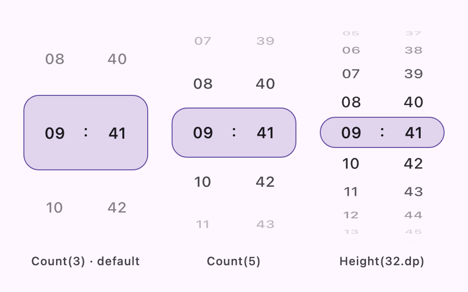
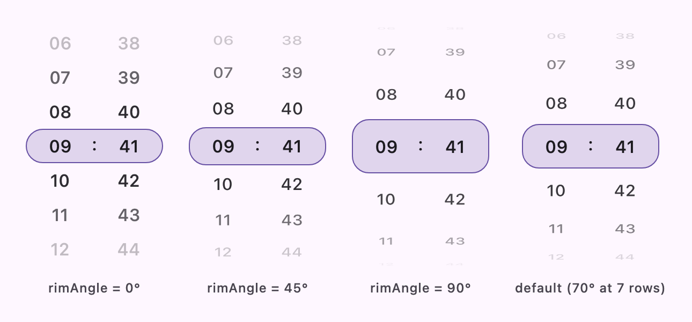

# Rows and barrel projection

> Applies to **1.5.0** (current `main`). Earlier releases only have `rowCount`; see
> [MIGRATION.md](../MIGRATION.md#14x--150).

Wheel rows are laid out on the front of a vertical cylinder, which gives the wheel the curved,
drum-like look of a native picker. Two parameters shape that drum:

| Parameter | Decides | Type |
|-----------|---------|------|
| [`rows`](#rows) | How the picker height is divided into rows | `WheelRows` |
| [`barrelProperties`](#barrel-projection) | How strongly the drum bends and fades | `BarrelProperties` |

The picker always occupies exactly the height you give it (or its intrinsic default,
see [Sizing](sizing.md)); the cylinder is sized to fit. Sizing, snapping and callbacks are not
affected by the barrel settings.

## Rows

`rows` decides how the wheel divides its height. Together with the height and the barrel angle it
fixes the geometry of the drum, and you choose which quantity stays constant:

```kotlin
WheelDatePicker(rows = WheelRows.Count(5)) { }        // exactly five rows from rim to rim
WheelDatePicker(rows = WheelRows.Height(32.dp)) { }   // 32.dp rows, as many as fit
```

| | `WheelRows.Count(n)` (default `Count(3)`) | `WheelRows.Height(h)` |
|---|---|---|
| Fixed quantity | Number of rows | Row and selector height |
| Rows shown | Exactly `n` from rim to rim | As many as fit, usually fractional; the outermost are cut off at the rim like a native iOS picker |
| Taller picker means | Taller rows | More rows, text size unchanged |
| Intrinsic height | ~42.7.dp per row (3 rows = 128.dp) | Seven rows |
| Default rim angle | 13° per row away from the center, capped at 70° | 90° |
| Use it when | You want a predictable number of visible values | You want the wheel to follow its container without the text changing size (iOS uses 32pt rows in a 216pt picker) |

<picture>
  <source media="(prefers-color-scheme: dark)" srcset="images/rows-dark.png">
  
</picture>

For `Count`, the selector is sized to the centered row. The drum always holds an **odd** number of
rows so that the selected row sits at the center with whole rows on both sides: an even `n` is
laid out as the next odd number (`Count(4)` shows the same five rows as `Count(5)`, while
`Count(4).count` stays `4`).

## Barrel projection

How strongly the drum bends is controlled by `rimAngle`, the rotation in degrees of the drum
surface where it meets the top and bottom edges of the viewport.

| `rimAngle` | Result |
|------------|--------|
| `0` | Flat, evenly spaced wheel with no projection (the fade still applies) |
| `1`–`89` | Partially curved drum |
| `90` | Full half cylinder, matching iOS, at the cost of the outermost rows becoming nearly unreadable against the rim |

<picture>
  <source media="(prefers-color-scheme: dark)" srcset="images/rim-angle-dark.png">
  
</picture>

When you do not pass `barrelProperties`, the picker uses
`WheelPickerDefaults.barrelPropertiesFor(rows)`:

- `WheelRows.Count`: 13° per row away from the center, capped at 70°. A 3-row wheel stays gently
  curved (26°), while a 7-row or taller wheel gets the full drum with every row still readable.
- `WheelRows.Height`: the full 90°, since no row count is promised.

To set it yourself, use `WheelPickerDefaults.barrelProperties(rimAngle, fadeStrength)`:

```kotlin
WheelDateTimePicker(
  modifier = Modifier.height(240.dp),
  rows = WheelRows.Count(11),
  barrelProperties = WheelPickerDefaults.barrelProperties(rimAngle = 90f, fadeStrength = 0.8f),
) { snappedDateTime -> }
```

### Fade

`fadeStrength` is how quickly rows become transparent as they leave the center. It must be
non-negative and finite (default `1`). A row's alpha is `1 - fadeStrength · t²`, clamped to
`[0, 1]`, where `t` is its on-screen distance from the center as a fraction of half the viewport
height.

| `fadeStrength` | Effect |
|----------------|--------|
| `0` | Every row stays opaque; only the geometry conveys depth |
| `1` (default) | Fully transparent exactly at the edge |
| `4` | Fully transparent halfway to the edge |
| above ~`10` | Even a tall drum leaves just the center row or two |

There is no upper bound because alpha is clamped: a value large enough to hide the nearest
neighboring row already hides everything past it. The fade follows the on-screen distance rather
than the drum angle, so a gently curved 3-row wheel and a flat wheel fade just like a full drum.

### With `Count` versus `Height`

With `WheelRows.Count` the outer rows are compressed, so the centered row gets more room than
`height / count` and the selector is sized to match it. With `WheelRows.Height` the row and
selector height are fixed and the angle only changes how many rows are visible.

The `rows` and `barrelProperties` parameters are available on `WheelDatePicker`,
`WheelTimePicker`, `WheelDateTimePicker` and `WheelTextPicker`.
